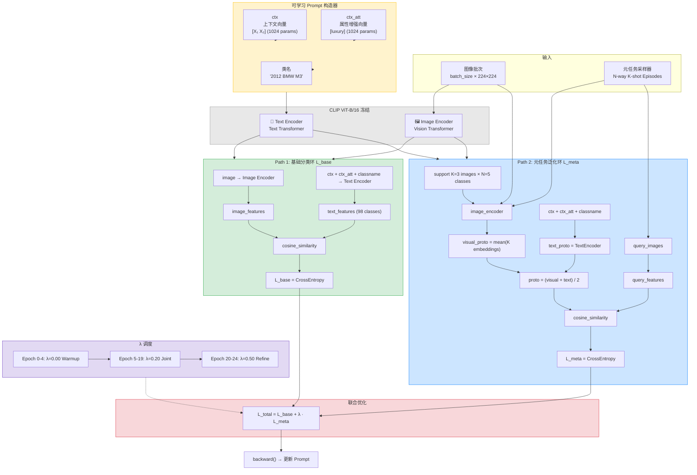
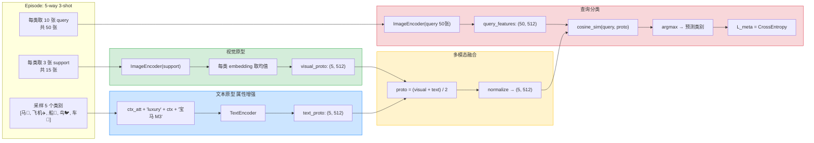
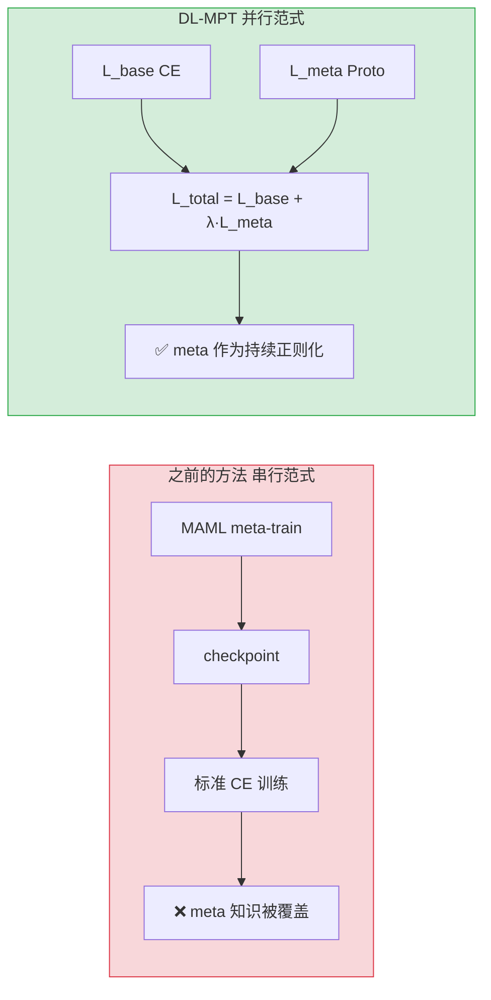
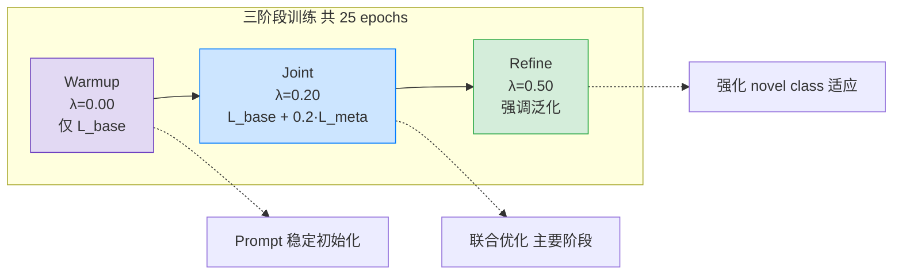

# DL-MPT: Dual-loop Meta Prompt Tuning 架构图

## 整体架构

```mermaid
graph TB
    subgraph INPUT[输入]
        IMAGE["图像批次<br/>batch_size × 224×224"]
        EPISODE["元任务采样器<br/>N-way K-shot Episodes"]
    end

    subgraph CLIP[CLIP ViT-B/16 冻结]
        IMGENC["🖼️ Image Encoder<br/>Vision Transformer"]
        TXTENC["📝 Text Encoder<br/>Text Transformer"]
    end

    subgraph PROMPT[可学习 Prompt 构造器]
        CTX["ctx<br/>上下文向量<br/>[X₁ X₂] (1024 params)"]
        ATTR["ctx_att<br/>属性增强向量<br/>[luxury] (1024 params)"]
        CLASSNAME["类名<br/>'2012 BMW M3'"]
    end

    subgraph BASE_LOOP["Path 1: 基础分类环 L_base"]
        direction TB
        B1["image → Image Encoder"] --> B2["image_features"]
        B3["ctx + ctx_att + classname → Text Encoder"] --> B4["text_features (98 classes)"]
        B2 --> B5["cosine_similarity"]
        B4 --> B5
        B5 --> B6["L_base = CrossEntropy"]
    end

    subgraph META_LOOP["Path 2: 元任务泛化环 L_meta"]
        direction TB
        M1["support K=3 images × N=5 classes"] --> M2["image_encoder"]
        M2 --> M3["visual_proto = mean(K embeddings)"]
        M4["ctx + ctx_att + classname"] --> M5["text_proto = TextEncoder"]
        M3 --> M6["proto = (visual + text) / 2"]
        M5 --> M6
        M7["query_images"] --> M8["query_features"]
        M6 --> M9["cosine_similarity"]
        M8 --> M9
        M9 --> M10["L_meta = CrossEntropy"]
    end

    subgraph JOINT[联合优化]
        J1["L_total = L_base + λ · L_meta"]
    end

    subgraph SCHEDULE[λ 调度]
        S1["Epoch 0-4: λ=0.00  Warmup"] --> S2["Epoch 5-19: λ=0.20  Joint"]
        S2 --> S3["Epoch 20-24: λ=0.50  Refine"]
    end

    IMAGE --> IMGENC
    IMAGE --> M2
    EPISODE --> M2
    EPISODE --> M7

    CTX --> PROMPT
    ATTR --> PROMPT
    CLASSNAME --> PROMPT
    PROMPT --> TXTENC

    IMGENC --> BASE_LOOP
    TXTENC --> BASE_LOOP
    IMGENC --> META_LOOP
    TXTENC --> META_LOOP

    B6 --> J1
    M10 --> J1
    SCHEDULE -.-> J1
    J1 --> BACK["backward() → 更新 Prompt"]

    style CLIP fill:#e8e8e8,stroke:#999
    style PROMPT fill:#fff3cd,stroke:#ffc107
    style BASE_LOOP fill:#d4edda,stroke:#28a745
    style META_LOOP fill:#cce5ff,stroke:#007bff
    style JOINT fill:#f8d7da,stroke:#dc3545
    style SCHEDULE fill:#e2d9f3,stroke:#6f42c1
```

---

## 元任务环 (L_meta) 详细流程

```mermaid
flowchart LR
    subgraph EPISODE["Episode: 5-way 3-shot"]
        direction TB
        E1["采样 5 个类别<br/>[马🐴, 飞机✈️, 船🚢, 鸟🐦, 车🚗]"]
        E2["每类取 3 张 support<br/>共 15 张"]
        E3["每类取 10 张 query<br/>共 50 张"]
    end

    subgraph VISUAL["视觉原型"]
        V1["ImageEncoder(support)"] --> V2["每类 embedding 取均值"]
        V2 --> V3["visual_proto: (5, 512)"]
    end

    subgraph TEXT["文本原型 属性增强"]
        T1["ctx_att + 'luxury' + ctx + '宝马 M3'"] --> T2["TextEncoder"]
        T2 --> T3["text_proto: (5, 512)"]
    end

    subgraph FUSION["多模态融合"]
        F1["proto = (visual + text) / 2"] --> F2["normalize → (5, 512)"]
    end

    subgraph CLASSIFY["查询分类"]
        C1["ImageEncoder(query 50张)"] --> C2["query_features: (50, 512)"]
        C2 --> C3["cosine_sim(query, proto)"]
        C3 --> C4["argmax → 预测类别"]
        C4 --> C5["L_meta = CrossEntropy"]
    end

    E2 --> V1
    E1 --> T1
    V3 --> F1
    T3 --> F1
    F2 --> C3
    E3 --> C1

    style VISUAL fill:#d4edda,stroke:#28a745
    style TEXT fill:#cce5ff,stroke:#007bff
    style FUSION fill:#fff3cd,stroke:#ffc107
    style CLASSIFY fill:#f8d7da,stroke:#dc3545
```

---

## 与对比方法的关系

```mermaid
graph LR
    subgraph OLD["之前的方法 串行范式"]
        A1["MAML meta-train"] --> A2["checkpoint"] --> A3["标准 CE 训练"]
        A3 --> A4["❌ meta 知识被覆盖"]
    end

    subgraph NEW["DL-MPT 并行范式"]
        B1["L_base CE"] --> B3["L_total = L_base + λ·L_meta"]
        B2["L_meta Proto"] --> B3
        B3 --> B4["✅ meta 作为持续正则化"]
    end

    style OLD fill:#f8d7da,stroke:#dc3545
    style NEW fill:#d4edda,stroke:#28a745
```

---

## 训练阶段与 λ 变化

```mermaid
graph LR
    subgraph STAGE["三阶段训练 共 25 epochs"]
        direction LR
        W["Warmup<br/>λ=0.00<br/>仅 L_base"] --> J["Joint<br/>λ=0.20<br/>L_base + 0.2·L_meta"]
        J --> R["Refine<br/>λ=0.50<br/>强调泛化"]
    end

    W -.-> P1["Prompt 稳定初始化"]
    J -.-> P2["联合优化 主要阶段"]
    R -.-> P3["强化 novel class 适应"]

    style W fill:#e2d9f3,stroke:#6f42c1
    style J fill:#cce5ff,stroke:#007bff
    style R fill:#d4edda,stroke:#28a745
```
